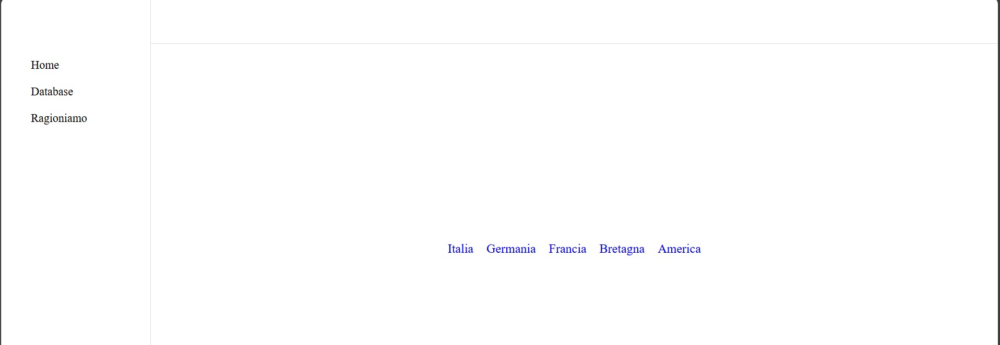

# Helper Non so


la grafica fa schifo però per i calcoli è funzionale

non ho utilizzato linguaggi di programmazione per portabilità 

non devi installare niente sul tuo pc.

---

cliccando su Home, 



si puo cliccare su uno dei link che rimando sul sito del relativo stato per visualizzare 
i titoli di stato (per alcuni fanno scaricare un pdf)

---

Per modificare il database devi creare una cartella allo stesso livello di *index.html*.

```text
  data
    ◌ prod
       ◌ data.js
       ◌ txt.js
 ✗ index.html
```

## Issues

icone non funzionanti
